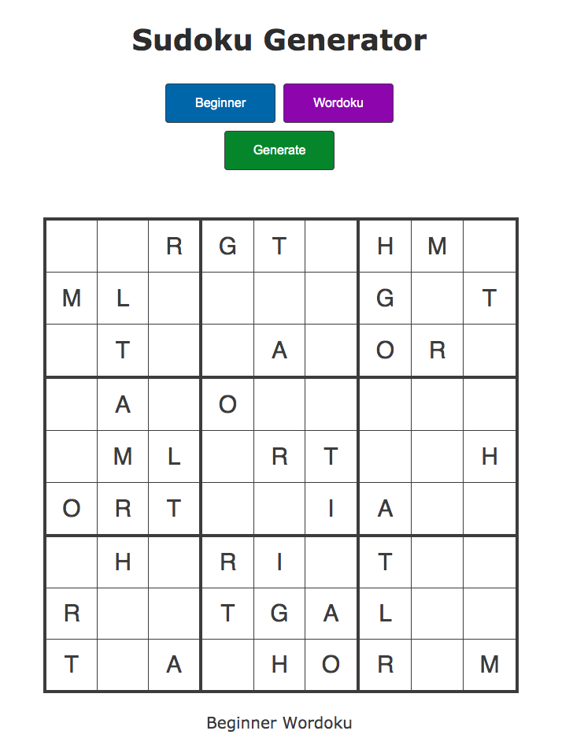
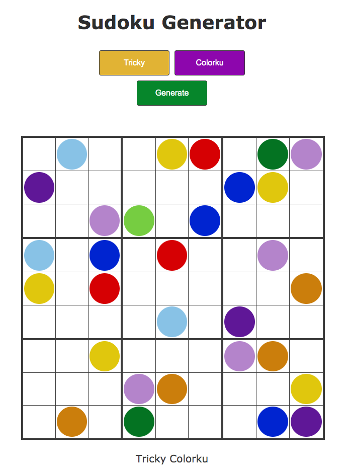

# purescript-wordoku

This is a full halogen app which includes a sudoku solver, sudoku generator, and the option to map sudokus to colors or words. The wordoku variant asserts the additional constraint that the diagonal from the upper left to the lower right must form a complete, unique set. This diagonal then spells a 9 letter english word when solved.

Difficulty levels map to a fixed number of starting cells:

| Level     | Starting Squares |
| --------- | ---------------- |
| Beginner  | 40               |
| Casual    | 34               |
| Tricky    | 30               |
| Difficult | 26               |
| Challenge | 22               |






## Dev
To install all PureScript dev env dependencies: (only needs to be run once)
```
npm install
```

Install app dependencies:
```
npm run-script install
```

Build the app with visible compiler errors:
```
pulp build
```

Build and run developer server:
```
npm run-script develop
```

Under the hood, npm uses the following tools and target directores:

| Tool     | Purpose                                 | Directory         |
| -------- | --------------------------------------- | ----------------- |
| `npm`    | install purescript, bower, pulp, parcel | node_modules      |
| `bower`  | install app dependencies                | bower_components/ |
| `pulp`   | build purescript dependencies, test app | output/           |
| `parcel` | making a deployment bundle              | dist/             |

## Deployment
Test locally and push to main. Netlify will build with the npm build script and DNS already points the sudoku.nathanielmay.com subdomain to the netlify app.

## Future work
- Use web workers to generate puzzles so the UI doesn't freeze up. Most puzzles are generated in less than a second but challenge puzzles often take 10 seconds or longer to generate.