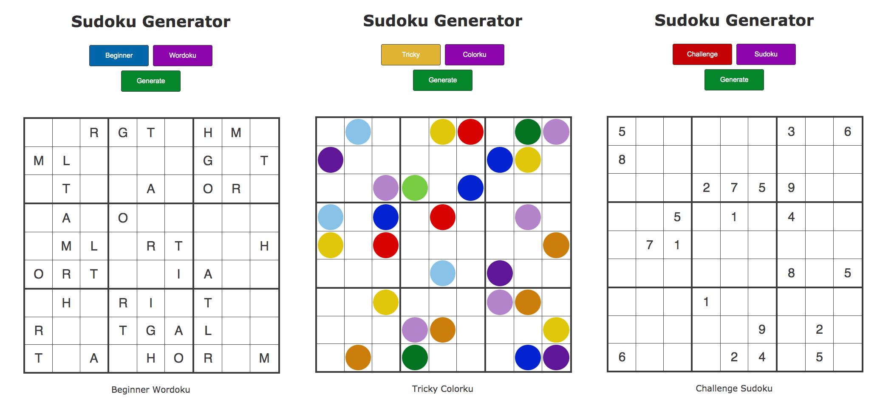

[](https://app.netlify.com/sites/stoic-poitras-5e2add/deploys)

# purescript-wordoku

Sudoku Generator is a PureScript Halogen app which includes a sudoku solver, sudoku generator, and the option to map sudokus to colors or words. The wordoku variant asserts the additional constraint that the diagonal from the upper left to the lower right must form a complete, unique set. This diagonal then spells a 9 letter english word when solved.

Difficulty levels map to a fixed number of starting cells:

| Level     | Starting Squares |
| --------- | ---------------- |
| Beginner  | 40               |
| Casual    | 34               |
| Tricky    | 30               |
| Difficult | 26               |
| Challenge | 22 (24 Standard) |

The Standard variant uses 24 starting squares at the Challenge level instead of 22. Its larger search space makes generating a unique puzzle with fewer clues exponentially more expensive, so the extra clues keep generation times usable.

All puzzles with the exception of colorkus can be printed directly through the browser by using the browser's print function. The provided `print.css` will remove buttons.

## App Screenshots



## Dev

**Prerequisites:** `git` must be on your PATH. If you use Zed on macOS, ensure `/opt/homebrew/bin` appears before `/Applications/Zed.app/Contents/MacOS` in your PATH, since Zed bundles a stripped-down git that lacks HTTPS transport.

Install npm tools: (only needs to be run once)

```
npm install
```

Install PureScript dependencies:

```
npm run ps-install
```

Build the app with visible compiler errors:

```
npx spago build
```

Run tests:

```
npm test
```

Benchmark the generation algorithm (single-threaded, prints per-difficulty timing tables):

```
npm run bench
```

### End-to-end tests

`test/e2e/worker_loop.spec.js` is a Puppeteer harness that exercises the worker pool against a real browser. It emulates a throttled Pixel 5, runs 50 generations back-to-back, and fails if the pool churns workers (re-spawning on every request) instead of reusing them. It's a manual check because it drives the running dev server rather than a fixture.

Start the dev server in one terminal:

```
npm run develop
```

Then run the harness in another (expects the app on `http://localhost:1234`):

```
npm run test:e2e:manual
```

Build and run developer server:

```
npm run develop
```

Under the hood, npm uses the following tools and target directories:

| Tool     | Purpose                                  | Directory     |
| -------- | ---------------------------------------- | ------------- |
| `npm`    | install purescript, spago, parcel        | node_modules/ |
| `spago`  | install and build PureScript deps, tests | output/       |
| `parcel` | bundle for deployment                    | dist/         |

## Deployment

Test locally and push to main. Netlify will build with the npm build script and DNS already points the sudoku.nathanielmay.com subdomain to the netlify app.

## Future work

- Add CI
- Add more tests
- Allow for printing colorkus.
